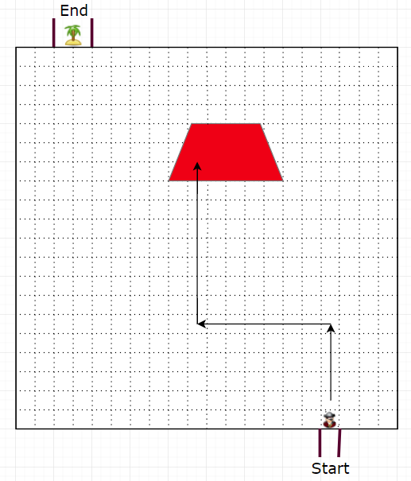

# Project Proposal: Pirate Island Game

**Group Members:** S1790173, S1783947, S1788971, S1138056

**Project Summary:** The goal of this project is to create an online puzzle game that will keep the user engaged. The game will make use of spatial objects stored in a database.

**Technical Reasoning:** This project will contain a number of spatial operations and data structures, allowing us to improve our knowledge of Oracle Spatial, while creating something fun and interactive.

## 1 Game Description

### 1.1 Primary Concept
*Pirate Island* is a puzzle game that challenges a user to navigate a pirate ship through treacherous waters during a lightening storm. Each level consists of a piece of sea with obstacles such as rocks, crocodiles and whirlpools that will complicate the navigation. The user gets to see the obstacles only for a short time while lightening strikes (e.g. for two seconds) and then has to enter moves (left 5, up 6, right 4 etc.) to get to the treasure island without hitting an obstacle. They submit their moves and the game engine returns the result visually, highlighting if they hit an obstacle. This obstacle then remains visible and the user gets another go. Every unsuccessful attempt to navigate the water results in less treasure points awarded for the level. The aim is to complete as many levels as possible with the highest overall score.
Simple mockups of the different stages of the level are provided at the end of this document.

### 1.2 Optional Functionalities
* An overall scoreboard is kept and displayed
* Obstacles have more complex characteristics (e.g. hitting a rock doesn't bring the pirate ship to sink completely but throws a man overboard which results in a loss of points)
* Bonuses are awarded if the user collects the floating booty on the route

## 2 Project Plan

### 2.1 Architecture Overview
An Oracle database structure stores multiple spatial objects that define a level (see Oracle 2018). These objects are polygons, lines or circles and image objects. Different levels reference different objects. A python script loads and displays the objects into an SVG grid for the user display. Screen changes and animations are handled within JavaScript. After the user submits moves the requested path is passed back to the database via python. A stored procedure determines whether the user path successfully navigates the ship to the other side of the grid. If not, the object that was struck is returned over the python script back to the user display resulting in an animation and the cycle will repeat. New levels will be added to the database using a stored procedure that validates the inputs and calculates game parameters using spatial and regular operations.

### 2.2 Technologies
* Oracle Spatial - spatial data plus stored procedures and views
* SVG - game display
* Python - database interaction and SVG rendering
* Jinja2 - HTML templates
* HTML5/CSS/Bootstrap - website styling and adaptive for devices
* JavaScript - client side controls and animations

### 2.3 Team Organisation
A framework, object model and data model will be defined upfront, splitting the work into components. Each team member will be responsible for a different component, such as the database structure, stored procedure for the user navigation, python script, data display and animation. GitHub will be used to share code between team members and place it under version control (see <https://github.com/maewart/pirateisland/>).

**Responsibilities:**

* Martin – Overall architecture and component coordination
* Marco and Callum – Database structure and python script
* Livia – Web display and animation effects
* All – Level design, testing

### 2.4 Time plan

An iterative software development model (see Tsai et al. 1997) will be applied. In a first cycle the minimal requirements for the game will be implemented and tested. Further cycles will add more functionalities and complexity to the game. A Gantt chart is attached as appendix.

## 3 Sources

### References
* Oracle, 2018. 2 Spatial Data Types and Metadata. Available at https://docs.oracle.com/cd/B28359_01/appdev.111/b28400/sdo_objrelschema.htm#SPATL020 [Accessed 20.01.2018].
* Tsai, BY., Stobart, S., Parrington, N. and Thompson, B., 1997. Software Quality Journal. 6(4). 295-309.

### Tools and Technologies
* Bootstrap - Available at https://getbootstrap.com/ [Accessed 20.01.2018]
* Jinja - Available at http://jinja.pocoo.org/ [Accessed 20.01.2018]
* SVG Documentation, Available at [http://www.w3.org/TR/SVG/](http://www.w3.org/TR/SVG/) [Accessed 04.01.2018].
* Tutorials Point - Available at https://www.tutorialspoint.com/svg/ [Accessed 20.01.2018]
* W3C Schools - Available at https://www.w3schools.com/ [Accessed 20.01.2018]

## Appendix

### Figure 1:  First view

### Figure 2: Blank view

### Figure 3: Fail

### Figure 4: Second attempt

### Figure 5: Completed level

### Table 1: Gantt chart
*to be inserted*
