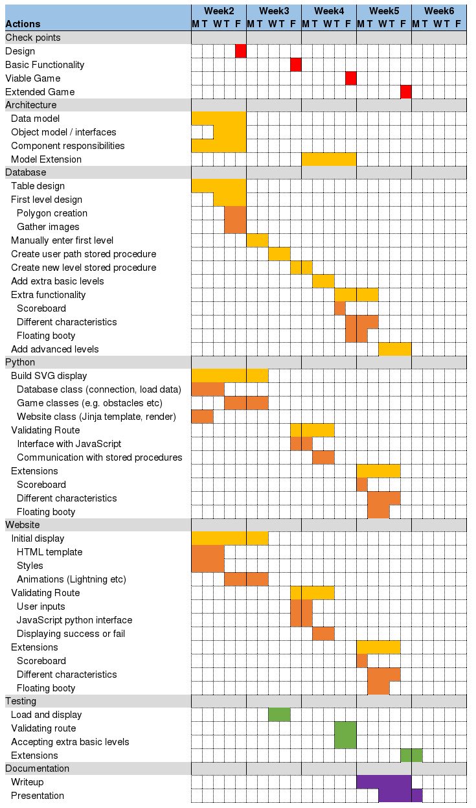

# Pirate Island Game

**Developers:** Martin Ewart, Livia Jakob, Marco Pizzo, Callum Crawford

**Website URLs**
* Home Page: https://www.geos.ed.ac.uk/~s1138056/pirate/
* Game: https://www.geos.ed.ac.uk/~s1138056/cgi-bin/pirate/main.py
* Code: https://github.com/maewart/pirateisland

**Project Summary:** The primary objective of this project was to implement a database in Oracle Spatial to store spatial data, and execute spatial queries and computations. This was achieved by building a game platform. This project contains a number of spatial operations and data structures, allowing us to improve our knowledge of Oracle Spatial, while creating something fun and interactive.

## 1 Game Description

*Pirate Island* is an interactive website that tasks the player to move a pirate ship to the treasure in the quickest time possible while a timer counts down. This can be done through the player typing the moves into an input box or by entering moves into a form. Islands, octopi and other frightening devils of the sea await however, with the weather ever-changing this is no easy task. On completion the player will collect the remaining seconds as points, which accumulate as they pass through the levels. Having completed all five levels (Figures 1 and 2) they will be prompted to add their pirate name to the leader board. Talented pirates are displayed on the leader board and their notoriety on the rough seas secured in the abysses of the database.

## 2 Architecture

### 2.1 Architecture Overview
An Oracle Spatial database (see Oracle 2018) stores levels and obstacles. A Python object model sits on top of the database that loads and creates dynamic content such as the level SVG which is then inserted into a Jinja2 template. JavaScript handles the user interaction and the game flow. After the player submits moves the requested path is passed through AJAX to a Python script. Spatial queries such as intersection and distance with Oracle Spatial determine whether the player successfully navigates the ship to the treasure. The validated path and information on whether the ship sinks, crashes or arrives at the treasure are handed back in JSON format. The use of AJAX enables the animation of the ship movement without refreshing the page. Adding a name and score to the leader board in the database follows a similar logic as the move submission described above.

### 2.2 Technologies

* SVG – Graphics of the games and website.
* Python 3 - Used to manage all interactions with the database. It generates the HTML code that forms the website and is acting as the translator between the user interface and the database.
* Nose – Used to unit test the Python code
* Jinja2 – Adds the SVG game field and other dynamic HTML content generated by Python to a HTML template.
* JavaScript - Responsible for the whole user interaction, handling of the game flow and dynamic game display such as animations.
* Bootstrap – Used to ensure that the website content is adaptive to different screen sizes.
* HTML5 – Displays the website content.
* CSS – Styles the website and SVG elements.
* Oracle Spatial – Stores level data and spatial objects with views sitting on top of the tables.
* AJAX (jQuery) – Passes the players moves to a Python script, which communicates with the database. In the opposite direction, it receives then the evaluated path from the database through Python without the need for refreshing the page.
* JSON – Data format to send and receive data with AJAX.
* GitHub – Used for collaborative work and version control.

### 2.3 Data Driven and Multi-User

The system has been designed so that all components are generic. Once added in the database, a level can be loaded, rendered and played without any code changes. The Python, JavaScript, AJAX and HTML code are completely data driven. This allows the following features:
* Flexible start/end points
* Grid adaptability
* Multiple objects per level
* Variable object size and types
* Objects can have different patterns and new patterns can be added
* Simple database entry changes or creates new levels without changing any code

Furthermore, the system allows multiple users to play the game at the same time.

## 3 Development and Collaboration
Team meetings were held bi-weekly to review progress and set tasks for the following few days. An iterative software development model (see Tsai et al. 1997) was used. In a first cycle the minimum requirements were implemented and tested and further cycles added more functionality.
GitHub was chosen for version control and to allow collaborate coding. The interfaces between components were designed and dummy data used allowing parallel development and unit testing. The code was regularly merged using GitHub which checks for conflicts during the merging process and stores previous versions of the files, allowing reversibility. Overall, 230 commits to the code base where performed across the team which demonstrates the extent of the collaboration over the five weeks period.

### Responsibilities
* Martin – He designed the overall framework and the interactions between the different components. He created a project plan and a Gantt chart (see appendix) and assigned clearly defined roles with individual responsibilities to the team members. In addition, Martin built the spatial calculations.
* Callum – He was in charge of the relational database design and implementation. This task included the creation of tables, inputting spatial and non-spatial data as well as creating views. Level design and diagram creation also fell into his remit.
* Marco – He developed the Python code that interacts with the database and generates the dynamic HTML code. He also took care of the graphics including the website and the SVG design.
* Livia – She developed the game flow and user interaction using JavaScript, AJAX and Python. She programmed web page animations, the interactions between the web page, Python and the database when submitting moves or retrieving new levels.

## 4 Summary
Within a short time frame, Pirate Island has been developed and released for beta testing. A generic framework has been created allowing configurable levels which can easily be extended. Furthermore, the game demonstrates storing spatial objects and performing spatial operations based on user inputs. In particular, an iterative spatial method was built that determines where a route intersects with a polygon. In addition, a fully interactive user interface that animates and moves spatial objects defined by the database has been built. Some limitations were found during the beta testing phase, however these can easily be addressed in future versions. Overall, a fun game with a flexible framework demonstrating a range of spatial database operations has been created.

## 5 Sources

### References
* Oracle, 2018. 2 Spatial Data Types and Metadata. Available at https://docs.oracle.com/cd/B28359_01/appdev.111/b28400/sdo_objrelschema.htm#SPATL020 [Accessed 20.01.2018].
* Tsai, BY., Stobart, S., Parrington, N. and Thompson, B., 1997. Software Quality Journal. 6(4). 295-309.

### Tools and Technologies
* Bootstrap - Available at https://getbootstrap.com/ [Accessed 20.01.2018]
* Jinja - Available at http://jinja.pocoo.org/ [Accessed 20.01.2018]
* SVG Documentation – Available at http://www.w3.org/TR/SVG/ [Accessed 04.01.2018].
* Tutorials Point - Available at https://www.tutorialspoint.com/svg/ [Accessed 20.01.2018]
* W3C Schools - Available at https://www.w3schools.com/ [Accessed 20.01.2018]

